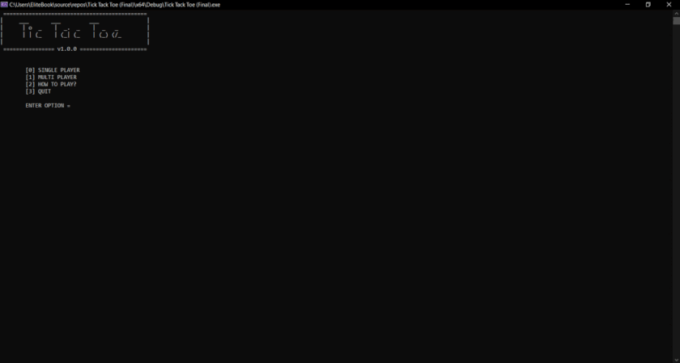

# Tic-Tac-Toe - C++
This is an implementation of Tic-Tac-Toe game in C++ - CLI edition.

# Main Features 🏆 
● Single-Player vs AI  
● Multi-Player  
● Main Menu  
● High Scrore (File Handling)  

# User Interface 💻

# Credit ✍️
This is a project from CL-1002: Engineering course of FAST University.

